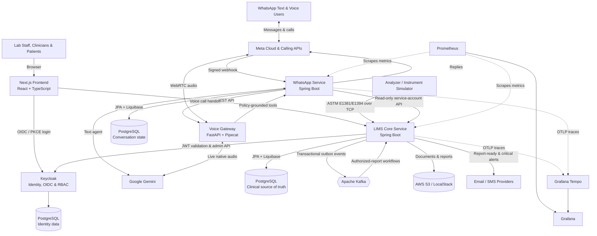

# Durdans LIMS

Enterprise Laboratory Information Management System (LIMS) for **Durdans Hospital, Sri Lanka**, built in partnership with **IFS Sri Lanka** and **University of Moratuwa**.


---

## 🌟 Overview

**Durdans LIMS** is a full-featured, secure, and highly scalable Laboratory Information Management System. It models and digitizes the end-to-end diagnostic and specimen lifecycle for hospital and reference laboratories, supporting high-throughput clinical workflows, real-time analytics, automated result ingestion, multi-tier authorization, and enterprise auditability.

This repository is organized as an enterprise **monorepo**: the web client, core backend services, instrument simulator, infrastructure-as-code, observability stack, and load tests live together with unified versioning and cohesive CI/CD workflows.

---

## 🏗️ System Architecture



Solid arrows represent application and data flows; dotted arrows represent telemetry. Local development uses Docker Compose, LocalStack, and containerized PostgreSQL, while Terraform provisions the AWS deployment.

---

## 🧰 Tech Stack

| Domain | Technologies |
|---|---|
| **Frontend** | Next.js 16 (App Router), React 19, TypeScript, Tailwind CSS 4, Axios, Keycloak-JS |
| **Backend Core** | Java 21, Spring Boot 3.5, Spring Security (OAuth2/JWT Resource Server), Spring Data JPA, Liquibase |
| **Identity & Security** | Keycloak 26 (OpenID Connect / OAuth 2.0 / RBAC), TLS, Gitleaks security scanners |
| **Data & Persistence** | PostgreSQL 15, Hibernate ORM, AWS S3 / LocalStack (Document & Report Storage) |
| **Event Streaming & Async** | Apache Kafka (KRaft mode), Transactional Outbox Pattern |
| **DevOps & Infrastructure** | Docker & Docker Compose, Terraform, Linux System Automation |
| **Observability & QA** | Prometheus, Grafana, Grafana Tempo (OpenTelemetry OTLP Traces), Alertmanager, k6, JUnit 5, Testcontainers |

---

## 🗂 Repository Layout

```text
apps/
├── frontend/                   # Next.js 16 · React 19 · TypeScript · Tailwind CSS · Keycloak-JS
├── lims-core-service/          # Spring Boot 3.5 · Java 21 · Gradle multi-module
│   ├── lims-core-service-api/  # API DTO contracts, Enums, and interface definitions
│   └── lims-core-service-app/  # Spring Boot implementation, Controllers, Services, DB Migrations
└── lims-instrument-simulator/  # Emits synthetic analyzer results for automated ingestion validation
infra/                          # Docker Compose full-stack, Terraform configs, Keycloak realm & themes, Observability
load-testing/                   # k6 load & performance testing scenarios
docs/                           # Architecture diagrams, ADRs, runbooks, deployment guides, reviews
tools/                          # Developer helper scripts & shared Git hooks
```

---

## 🔬 Clinical Workflow

The system models the complete specimen lifecycle with automated audit logging, validation gates, and role boundaries:

```text
[Patient Registration] ──▶ [Order & Billing] ──▶ [Phlebotomy (Collection)]
                                                          │
                                                          ▼
[Pathologist Authorization] ◀── [Supervisor Verification] ◀── [MLT Result Entry / Analyzer Ingestion]
         │
         ▼
[Automated Dispatch (Email / SMS)] ──▶ [Patient & Doctor Portal / Archival]
```

### 👥 Role-Based Access Control (RBAC)

The application enforces granular role-based security via Keycloak JWT scopes:

- 🧑‍🔬 **MLT** (*Medical Laboratory Technician*): Specimen accessioning, test result entry, instrument batch review.
- 🔬 **LAB_SUPERVISOR**: Result validation, discrepancy resolution, delta checks, quality control review.
- 🩺 **PATHOLOGIST**: Clinical evaluation and final medical report authorization.
- 💉 **PHLEBOTOMIST**: Sample collection, barcode scanning, container verification, sample rejection/recollection.
- 💳 **BILLING / RECEPTIONIST**: Patient registration, test ordering, invoice generation, cashier settlement.
- 📤 **DISPATCH**: PDF report generation, physical delivery tracking, SMS/email notifications.
- 🏢 **BRANCH_ADMIN**: Branch operational metrics, staff assignment, local inventory oversight.
- ⚙️ **SUPER_ADMIN**: Global system configuration, test catalogue definition, reference ranges, audit log inspections.

---

## 🚀 Getting Started & Local Setup

### 📋 Prerequisites

Ensure you have the following installed on your machine:
- **Docker Desktop** (Engine 24+)
- **Java Development Kit (JDK) 21**
- **Node.js 20+** with **pnpm** / **npm**

---

### Option A: Complete Stack via Docker Compose (Recommended)

Bring up the entire platform including databases, messaging, identity provider, backend, frontend, and monitoring with one command:

```bash
# 1. Navigate to infrastructure folder
cd infra

# 2. Configure environment
cp .env.example .env

# 3. Spin up all containers
docker compose up -d --build
```

---

### Option B: Running Individual Services for Development

#### 1. Backend Core Service (Spring Boot)

```bash
cd apps/lims-core-service

# Build and execute tests
./gradlew clean build

# Run application
./gradlew :lims-core-service-app:bootRun
```
*API accessible at `http://localhost:11000` (Swagger UI: `http://localhost:11000/swagger-ui.html`)*

#### 2. Frontend Web Application (Next.js)

```bash
cd apps/frontend

# Install dependencies
npm install # or pnpm install

# Start development server
npm run dev
```
*Frontend accessible at `http://localhost:3000`*

#### 3. Cloud Infrastructure Provisioning (Terraform / AWS)

```bash
cd infra/terraform

# Initialize and plan
cp terraform.tfvars.example terraform.tfvars
terraform init
terraform plan
terraform apply
```
*Provisions VPC, EC2 host, managed RDS PostgreSQL, S3 report storage, ECR repositories, and AWS Secrets Manager.*

---

## 🌐 Services & Ports Mapping

When the infrastructure stack is active, the following endpoints are published:

| Service | Host Port | Internal / Container Port | Description |
|---|---|---|---|
| **Frontend Web App** | `3000` | `3000` | Next.js 16 UI |
| **Core Service API** | `11000` | `11000` | Spring Boot REST API |
| **Core Management / Actuator** | *Internal* | `11001` | Private network metrics & health checks |
| **Keycloak IAM** | `8081` | `8080` | Identity & Access Management (`lims-realm`) |
| **LIMS PostgreSQL** | `5434` | `5432` | Primary Database (`durdans_lims_db`) |
| **Keycloak PostgreSQL** | `5433` | `5432` | IAM Database (`keycloak`) |
| **Apache Kafka** | `9092` | `9092` | Event Broker (KRaft Mode) |
| **LocalStack (AWS S3)** | `4566` | `4566` | S3 API Emulation for Medical Reports |
| **Prometheus** | `9090` | `9090` | Metrics Scraper & TSDB |
| **Alertmanager** | `9093` | `9093` | Alert Dispatcher & Notification Rules |
| **Grafana** | `3001` | `3000` | Telemetry & Observability Dashboards |
| **Grafana Tempo** | `3200` | `3200` | Distributed Trace Storage & Search |

---

## 📊 Scope & Test Coverage

- **Implemented & Real:** End-to-end clinical workflow, Keycloak OIDC/RBAC token validation, audit trail, transactional outbox pattern, PDF report rendering & email/SMS dispatch, Liquibase database migrations.
- **Instrument Ingestion:** Integrated through `lims-instrument-simulator` which exercises real ingestion REST/Kafka pipelines with synthetic analyzer results.
- **Automated Test Suite:**
  - **131 Backend Tests** spanning 27 test classes including Testcontainers-backed integration tests on actual PostgreSQL instances.
  - **13 Frontend Component Tests** validating core UI flows.
  - **k6 Performance Tests** covering simulated high-concurrency peak load.

---

## 🔐 Security & Best Practices

- **Zero Hardcoded Secrets**: All credentials and tokens are injected via environment variables.
- **Pre-commit Scans**: Shared git hooks enforce Gitleaks secrets detection before code can be committed.
- **Isolated Network Architecture**: Database and actuator management ports remain private and unexposed in production.
- Please review [SECURITY.md](SECURITY.md) for vulnerability disclosure guidelines and secure configuration protocols.

```bash
# Install local developer git hooks
./tools/install-hooks.sh
```

---

## 📜 Documentation & History

- 📖 **Architecture & Operations**: Check [`docs/`](docs/) for deployment runbooks, architecture decision records (ADRs), and system reviews.
- 🏛️ **Consolidation History**: Refer to [`docs/HISTORY.md`](docs/HISTORY.md) for provenance of initial standalone repositories.
- 👥 **Team & Authorship**: Full contributor breakdown available in [`CONTRIBUTORS.md`](CONTRIBUTORS.md).

---

<div align="center">
  <sub>Built with ❤️ for Durdans Hospital by University of Moratuwa & IFS Sri Lanka</sub>
</div>
